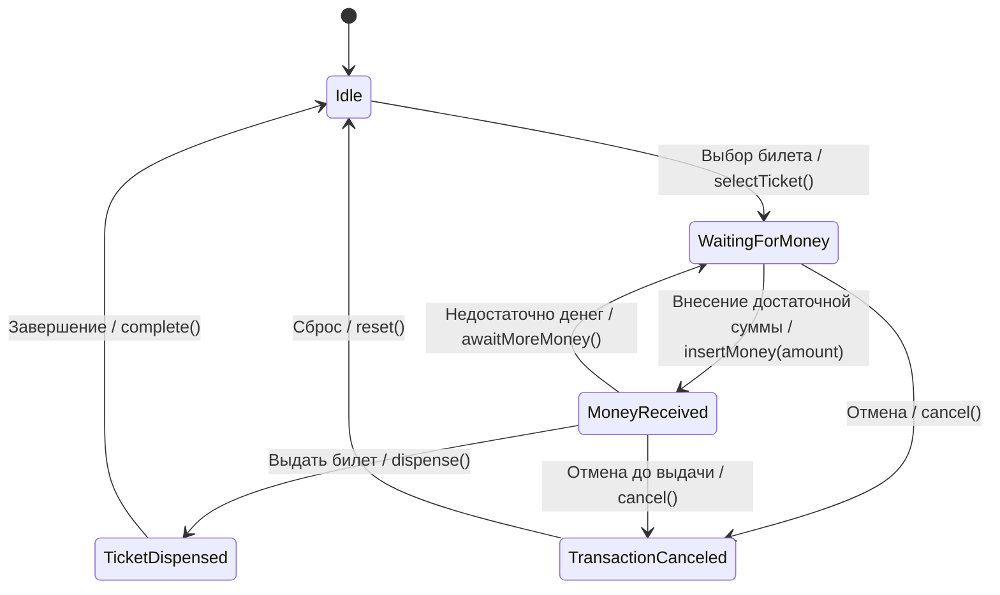

```mermaid
stateDiagram-v2
    [*] --> Idle

    Idle --> WaitingForMoney : Выбор билета / selectTicket()
    WaitingForMoney --> MoneyReceived : Внесение достаточной суммы / insertMoney(amount)
    MoneyReceived --> TicketDispensed : Выдать билет / dispense()

    WaitingForMoney --> TransactionCanceled : Отмена / cancel()
    MoneyReceived --> TransactionCanceled : Отмена до выдачи / cancel()

    TicketDispensed --> Idle : Завершение / complete()
    TransactionCanceled --> Idle : Сброс / reset()

    MoneyReceived --> WaitingForMoney : Недостаточно денег / awaitMoreMoney()


```
