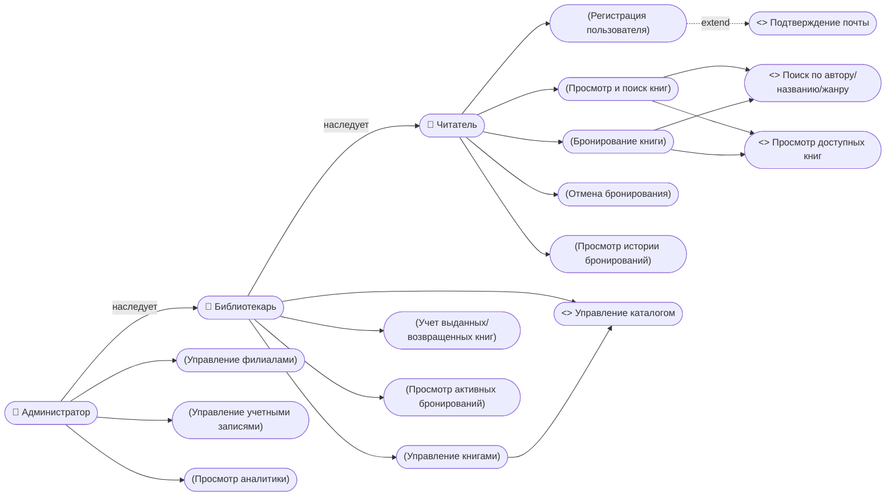

```mermaid
flowchart LR
    %% ==== ACTORS ====
    Reader(["👤 Читатель"])
    Librarian(["👤 Библиотекарь"])
    Admin(["👤 Администратор"])

    %% ==== INHERITANCE ====
    Librarian -->|наследует| Reader
    Admin -->|наследует| Librarian

    %% ==== USE CASES ====
    UC_Register(["(Регистрация пользователя)"])
    UC_ViewSearch(["(Просмотр и поиск книг)"])
    UC_Search(["<<include>> Поиск по автору/названию/жанру"])
    UC_ViewAvailable(["<<include>> Просмотр доступных книг"])
    UC_Reserve(["(Бронирование книги)"])
    UC_CancelReserve(["(Отмена бронирования)"])
    UC_History(["(Просмотр истории бронирований)"])

    UC_ManageBooks(["(Управление книгами)"])
    UC_LoanReturn(["(Учет выданных/возвращенных книг)"])
    UC_ActiveRes(["(Просмотр активных бронирований)"])
    UC_Catalog(["<<include>> Управление каталогом"])

    UC_Branches(["(Управление филиалами)"])
    UC_UserAccounts(["(Управление учетными записями)"])
    UC_Analytics(["(Просмотр аналитики)"])

    UC_EmailConfirm(["<<extend>> Подтверждение почты"])

    %% ==== CONNECTIONS Actor -> Use Cases ====
    Reader --> UC_Register
    Reader --> UC_ViewSearch
    Reader --> UC_Reserve
    Reader --> UC_CancelReserve
    Reader --> UC_History

    Librarian --> UC_ManageBooks
    Librarian --> UC_LoanReturn
    Librarian --> UC_ActiveRes
    Librarian --> UC_Catalog

    Admin --> UC_Branches
    Admin --> UC_UserAccounts
    Admin --> UC_Analytics

    %% ==== INCLUDE RELATIONS ====
    UC_ViewSearch --> UC_Search
    UC_ViewSearch --> UC_ViewAvailable
    UC_Reserve --> UC_Search
    UC_Reserve --> UC_ViewAvailable
    UC_ManageBooks --> UC_Catalog

    %% ==== EXTEND RELATION ====
    UC_Register -.->|extend| UC_EmailConfirm
```
